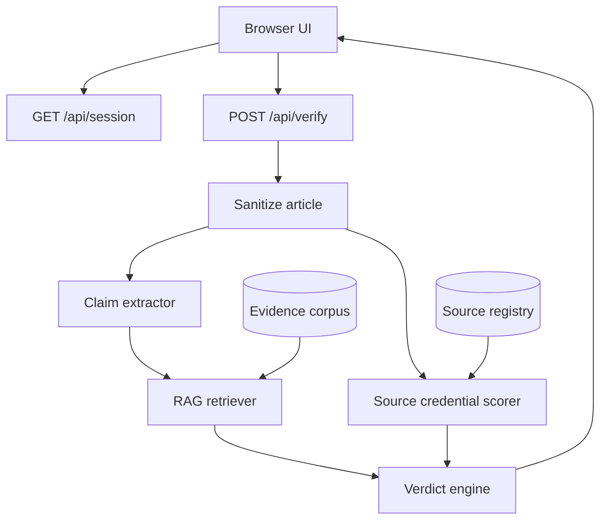

# Architecture



## Modules

- `server/index.js`: HTTP server and API routes.
- `server/lib/text.js`: sanitization, tokenization, domain parsing, and claim extraction.
- `server/lib/credentials.js`: source registry matching and credential scoring.
- `server/lib/rag.js`: evidence retrieval.
- `server/lib/verifier.js`: scoring and verdict assembly.
- `server/lib/security.js`: headers, CSRF, sessions, rate limits, body limits.

## API

### `GET /api/session`

Returns a CSRF token.

### `GET /api/samples`

Returns demo credible and risky stories.

### `GET /api/corpus`

Returns evidence and source registry summaries.

### `POST /api/verify`

Request:

```json
{
  "article": {
    "title": "Story headline",
    "sourceUrl": "https://example.com/story",
    "author": "Reporter",
    "publishedAt": "2026-07-02",
    "body": "Article text..."
  }
}
```

Response:

```json
{
  "ok": true,
  "result": {
    "score": 58,
    "verdict": { "label": "Unverified", "tone": "caution" },
    "credentials": {},
    "claims": [],
    "evidence": [],
    "warnings": []
  }
}
```
