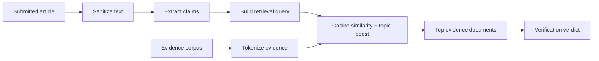

# RAG Implementation

## Data

The RAG corpus lives in `data/evidence-corpus.json`. Each document contains:

- `id`
- `title`
- `source`
- `sourceUrl`
- `topics`
- `credibility`
- `summary`
- `claims`

The source registry lives in `data/source-registry.json` and gives each known domain a credential baseline.

## Retrieval Flow

The current implementation is in `server/lib/rag.js`.

### Similarity

The app uses token cosine similarity:

1. Convert query and evidence text to lowercase tokens.
2. Remove common stop words.
3. Count token frequencies.
4. Compute cosine similarity between the query vector and document vector.
5. Add boosts for topic hits and document credibility.

This is intentionally deterministic so tests can assert exact behavior.

## Verdict Flow

`server/lib/verifier.js` combines:

- Source credential score.
- Average retrieved evidence score.
- Ratio of claims with matching evidence.
- Bonuses for evidence-bearing language.
- Penalties for missing metadata, sensational phrasing, weak sourcing, and claim gaps.

The result is an explainable score and label:

- `High confidence`
- `Likely credible, needs monitoring`
- `Unverified`
- `High risk`

## Production Upgrade Path

1. Chunk evidence documents into smaller passages.
2. Generate embeddings for each passage.
3. Store embeddings in a vector database.
4. Embed extracted claims.
5. Retrieve top-k passages by vector similarity plus freshness and source credibility.
6. Ask an LLM to produce a JSON verdict using only retrieved evidence.
7. Store retrieved passage IDs and hashes with every verdict.

The important thing is not the vector database. The important thing is the boundary: user-submitted news never becomes instruction; it becomes a query against trusted evidence.
